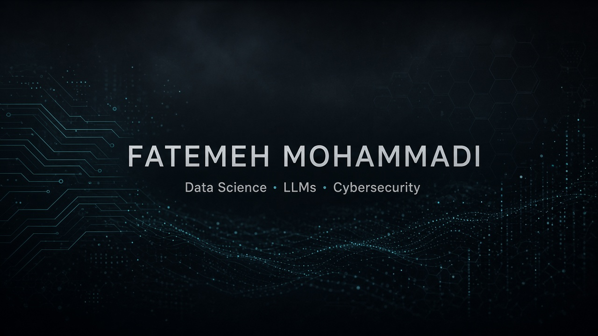

<!-- ============================================================
  Fatemeh Mohammadi — GitHub Profile
  Data Science × LLMs × Cybersecurity
============================================================ -->

<div align="center">

  

  <br/><br/>

  

  <br/>

  

  <br/><br/>

  <a href="https://github.com/fatemehmohammmadi">
    
  </a>
  <a href="https://www.linkedin.com/in/fateme-mohammadi-bb7b683b1">
    
  </a>
  
  

</div>

<br/>


---

##  Who I am

<table>
<tr>
<td width="62%" valign="top">

I'm **Fatemeh Mohammadi** — building at the edge of **data science**, **large language models**, and **cybersecurity**.

I like systems that don't just predict… they **detect**, **explain**, and help analysts move faster.

```python
class Fatemeh:
    role = "Data Scientist & AI Researcher"
    education = "M.Sc. Computer Networks @ University of Yazd"
    languages = ["Python"]
    obsessions = [
        "LLM fine-tuning for security",
        "threat / anomaly detection",
        "security intelligence from messy logs",
    ]
    loop = "Data → Model → Signal → Decision"
```

</td>
<td width="38%" valign="top" align="center">


<br/>

**Mindset**

`hunt` → `learn` → `fine-tune` → `defend`

</td>
</tr>
</table>


---

##  Core radar

<p align="center">
  
</p>

<p align="center">
  
  
  
</p>

<br/>

<details open>
<summary><b>🧬 Research threads I keep pulling</b></summary>
<br/>

| | |
|:--|:--|
| 🔍 **Threat & anomaly detection** | Catch weird network / log behavior before it becomes an incident |
| 🧠 **Security-focused LLMs** | Adapt language models to alerts, logs, playbooks, CVEs |
| 🛰️ **Security intelligence** | Turn raw telemetry into ranked, explainable signals |
| 📚 **Security datasets** | Build reproducible mini-labs and evaluation loops |

</details>


---

##  Live mission board

> Mini security-DS labs — each repo is runnable with sample outputs.

<p align="center">
  <a href="https://github.com/fatemehmohammmadi/01-network-flow-eda"></a>
  <a href="https://github.com/fatemehmohammmadi/12-beaconing-detector"></a>
</p>
<p align="center">
  <a href="https://github.com/fatemehmohammmadi/03-security-log-finetune"></a>
  <a href="https://github.com/fatemehmohammmadi/17-security-rag-assistant"></a>
</p>
<p align="center">
  <a href="https://github.com/fatemehmohammmadi/14-soc-alert-triage-ranker"></a>
  <a href="https://github.com/fatemehmohammmadi/19-dns-tunnel-detector"></a>
</p>

<details>
<summary><b>🗂️ Full lab index (20 projects)</b></summary>

<br/>

| # | Project | Vibe |
|--:|---------|------|
| 01 | [network-flow-eda](https://github.com/fatemehmohammmadi/01-network-flow-eda) | EDA + Isolation Forest |
| 02 | [ids-alert-classifier](https://github.com/fatemehmohammmadi/02-ids-alert-classifier) | Benign vs attack alerts |
| 03 | [security-log-finetune](https://github.com/fatemehmohammmadi/03-security-log-finetune) | Log NLP / fine-tune path |
| 04 | [threat-intel-enrichment](https://github.com/fatemehmohammmadi/04-threat-intel-enrichment) | IP risk enrichment |
| 05 | [flow-feature-pipeline](https://github.com/fatemehmohammmadi/05-flow-feature-pipeline) | Feature engineering |
| 06 | [portscan-detector](https://github.com/fatemehmohammmadi/06-portscan-detector) | Scan behavior |
| 07 | [phishing-url-classifier](https://github.com/fatemehmohammmadi/07-phishing-url-classifier) | Lexical phishing |
| 08 | [log-autoencoder-anomaly](https://github.com/fatemehmohammmadi/08-log-autoencoder-anomaly) | AE anomalies |
| 09 | [cve-embedding-search](https://github.com/fatemehmohammmadi/09-cve-embedding-search) | CVE semantic search |
| 10 | [protocol-clustering](https://github.com/fatemehmohammmadi/10-protocol-clustering) | Unsupervised flows |
| 11 | [dga-domain-detector](https://github.com/fatemehmohammmadi/11-dga-domain-detector) | DGA domains |
| 12 | [beaconing-detector](https://github.com/fatemehmohammmadi/12-beaconing-detector) | C2 beacons |
| 13 | [mitre-attack-mapper](https://github.com/fatemehmohammmadi/13-mitre-attack-mapper) | ATT&CK mapping |
| 14 | [soc-alert-triage-ranker](https://github.com/fatemehmohammmadi/14-soc-alert-triage-ranker) | Alert ranking |
| 15 | [encrypted-traffic-classifier](https://github.com/fatemehmohammmadi/15-encrypted-traffic-classifier) | TLS metadata ML |
| 16 | [lateral-movement-graph](https://github.com/fatemehmohammmadi/16-lateral-movement-graph) | Auth graphs |
| 17 | [security-rag-assistant](https://github.com/fatemehmohammmadi/17-security-rag-assistant) | Local RAG |
| 18 | [ids-model-drift-monitor](https://github.com/fatemehmohammmadi/18-ids-model-drift-monitor) | Drift / PSI |
| 19 | [dns-tunnel-detector](https://github.com/fatemehmohammmadi/19-dns-tunnel-detector) | DNS tunnels |
| 20 | [zeek-conn-analytics](https://github.com/fatemehmohammmadi/20-zeek-conn-analytics) | Zeek hunting |

</details>


---

##  Stack in motion

<p align="center">
  
</p>

<p align="center">
  
  
  
  
  
</p>


---

##  Signal board

<div align="center">

  
  

</div>

<br/>

<p align="center">
  
</p>

<p align="center">
  
</p>

<p align="center">
  
</p>


---

##  Currently in the lab

```text
 ┌──────────────────────────────────────────────┐
 │   LLM Fine-Tuning                            │
 │            ↓                                 │
 │   Security Telemetry                         │
 │            ↓                                 │
 │   Detection / Hunting Models                 │
 │            ↓                                 │
 │   Analyst-ready Signals                      │
 └──────────────────────────────────────────────┘
```

<p align="center">
  
</p>


---

## Contribution snake

<p align="center">
  
</p>
<p align="center">
  
</p>

> Snake auto-updates via GitHub Actions (`.github/workflows/snake.yml`). First run may take a minute after this push.


---

##  Let's connect

<p align="center">
  <a href="https://github.com/fatemehmohammmadi">
    
  </a>
  <a href="https://www.linkedin.com/in/fateme-mohammadi-bb7b683b1">
    
  </a>
</p>

<p align="center">
  
</p>

<p align="center">
  <b>Fatemeh Mohammadi</b><br/>
  <sub>Data → Intelligence → Security</sub>
</p>

<br/>

<div align="center">
  
</div>
